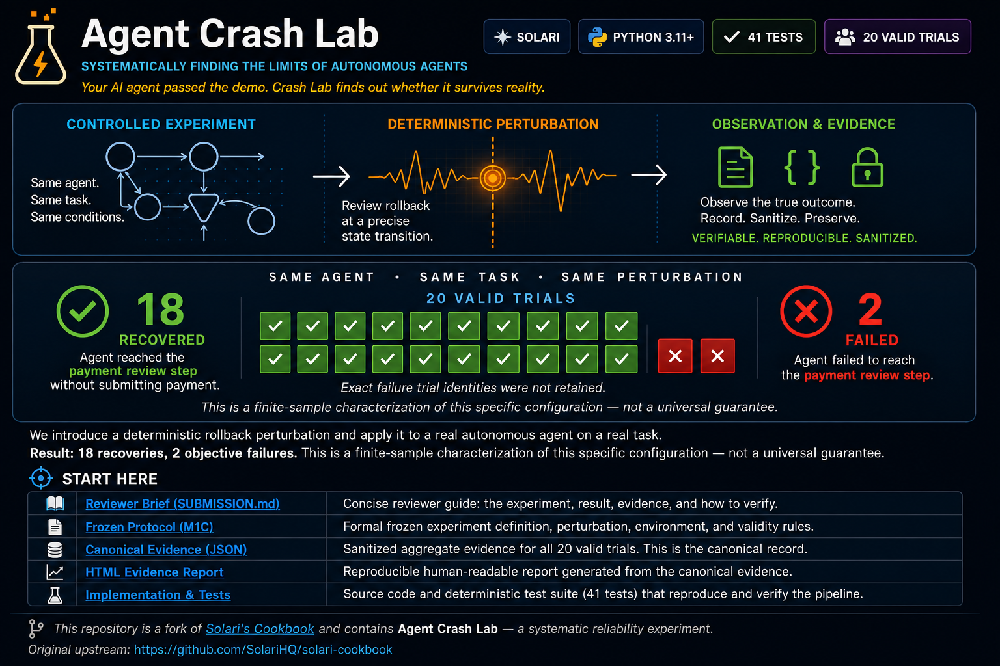

# Agent Crash Lab



> **Your AI agent passed the demo. Crash Lab finds out whether it survives reality.**

Agent Crash Lab is a chaos-engineering and reliability-testing project for autonomous computer-use agents, built on Solari. It creates deterministic adversarial web environments, runs a real autonomous browser agent in recorded Solari Browser sessions, and judges outcomes with server-authoritative state rather than trusting the agent's own final message.

## The result

**Same autonomous agent. Same task. Same deterministic rollback perturbation. Twenty valid runs: 18 recoveries, 2 objective failures.**

Both objective failures ended `incomplete_at_shipping`. The observed failure rate was **10.0%**; the two-sided 95% Wilson interval for the underlying failure probability in this frozen setup was **2.8%–30.1%**.

That is intentionally a finite-sample characterization of one frozen agent/task/environment configuration — not a universal model reliability claim.

## Start here

| Reviewer path | What it contains |
| --- | --- |
| [Agent Crash Lab project](projects/agent-crash-lab-m1/) | Architecture, experiment history, validation commands, repository map |
| [Reviewer brief](projects/agent-crash-lab-m1/SUBMISSION.md) | Fastest path through the challenge submission and why the result matters |
| [Frozen M1C protocol](projects/agent-crash-lab-m1/M1C_FROZEN_SPEC.md) | The 20-valid-trial reliability protocol frozen before live execution |
| [Canonical evidence](projects/agent-crash-lab-m1/evidence/m1c_characterization.json) | Sanitized machine-readable M1C result and explicit evidence-retention gaps |
| [M2 evidence/reporting spec](projects/agent-crash-lab-m1/M2_FROZEN_SPEC.md) | Frozen rules for converting the live result into reviewer evidence |

The standalone HTML evidence report is generated deterministically from the canonical sanitized artifact:

```powershell
cd projects\agent-crash-lab-m1
python m2_report.py
Start-Process .\evidence\m1c_report.html
```

No live Solari, OpenAI, browser-use, or network access is required to generate the M2 report from the committed evidence artifact.

## What Crash Lab tests

A normal agent demo asks whether the agent can complete a task once. Crash Lab asks a harder question: **does the same agent continue to behave reliably when the environment changes in controlled, reproducible ways?**

The project progressed through increasingly realistic experiments:

1. **M0 — harness proof.** A deterministic UI mutation reproducibly broke a deliberately brittle Playwright policy.
2. **M1A — real autonomous agent.** A browser-use/OpenAI agent survived the frozen initial mutation campaign; the correct result was recorded as **inconclusive** rather than tuning the test until it failed.
3. **M1B — state-machine perturbations.** A deterministic `review_rollback` condition produced divergent confirmation outcomes: one objective failure and one recovery. It therefore did **not** prove a deterministic breaker.
4. **M1C — reliability characterization.** The exact condition, task, and agent configuration were frozen and repeated until exactly 20 valid trials were collected: **18 recoveries, 2 failures**.
5. **M2 — evidence.** The completed result was converted into a sanitized machine-readable artifact and deterministic offline HTML report without changing the experiment.

The interesting finding is therefore not “we found a trick that always breaks an agent.” It is that **the same deterministic disruption can produce different autonomous outcomes**, and those outcomes can be characterized objectively rather than hidden behind a successful single-run demo.

## Architecture

```text
Solari Sandbox
  -> deterministic ChaosShop target
  -> authoritative task state + event oracle
  -> Solari preview capability

Solari Browser (recording enabled)
  -> CDP connection
  -> browser-use autonomous agent
  -> provider-backed LLM

Agent Crash Lab
  -> frozen adversarial campaign
  -> objective PASS / FAIL classification
  -> minimization / repeated reliability characterization
  -> sanitized evidence contract
  -> deterministic offline evidence report
```

Solari provides the remote browser/sandbox infrastructure and session recording. browser-use provides the autonomous agent loop. Agent Crash Lab provides the adversarial state machine, experiment freeze rules, server-authoritative oracle, infrastructure-vs-agent failure classification, reliability characterization, sanitization, and evidence presentation.

## Experiment integrity

The project deliberately treats evaluation methodology as part of the product:

- perturbations and acceptance rules are frozen before observing the result;
- agent/task settings are not tuned after a failure or recovery is observed;
- the server-side state machine, not agent self-report, decides PASS/FAIL;
- infrastructure-invalid attempts are excluded from agent-failure counts;
- M1C required exactly 20 valid trials with no early stopping;
- missing historical per-trial evidence remains visibly unavailable rather than being guessed;
- credential-bearing Solari preview, CDP/WS, session/sandbox, API-key, and signed replay capabilities are not committed as evidence.

## Validate locally

From `projects/agent-crash-lab-m1`:

```powershell
python -m unittest -v test_m1b_state_machine.py test_m1b_campaign.py test_m1c_reliability.py test_m2_evidence.py test_m2_report.py
```

Current combined offline gate: **41 tests**.

Live agent experiments additionally require Python 3.11+, the dependencies in `requirements.txt`, and locally configured `SOLARI_API_KEY` and `OPENAI_API_KEY`. Never commit secrets or capability URLs.

## Built with AI

Agent Crash Lab was developed with AI-assisted engineering, including implementation, test design, experiment review, debugging, documentation, and evidence presentation. AI accelerated the build; frozen protocols, objective server-side oracles, automated tests, and retained evidence were used to keep the experimental conclusions independently verifiable.

## Repository layout

This repository began as a fork of the public Solari cookbook for the Solari engineering challenge. The upstream cookbook examples are intentionally retained under [`examples/`](examples/) for provenance and reference.

Agent Crash Lab lives under [`projects/`](projects/):

- [`projects/agent-crash-lab-m0/`](projects/agent-crash-lab-m0/) — initial harness proof;
- [`projects/agent-crash-lab-m1/`](projects/agent-crash-lab-m1/) — autonomous-agent experiments, frozen protocols, M1C characterization, evidence contract, tests, and reviewer documentation.

For the shortest review, continue with the **[Agent Crash Lab reviewer brief](projects/agent-crash-lab-m1/SUBMISSION.md)**.

## Attribution

Agent Crash Lab was developed in a fork of the Solari cookbook as a real use case for Solari Browsers and Sandboxes. The original cookbook examples and MIT license remain in this repository. Solari project documentation is available from the upstream Solari project.
